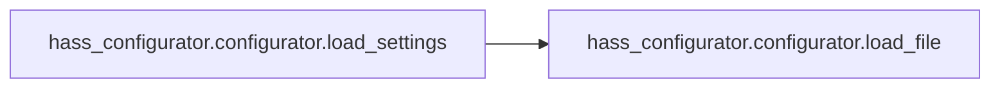
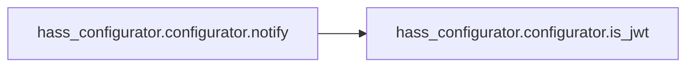
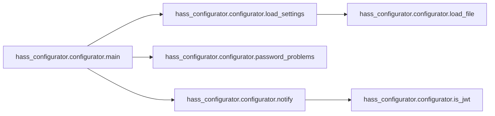

# Key Objects

[_Documentation generated by Documatic_](https://www.documatic.com)

<!---Documatic-section-hass_configurator.configurator.signal_handler-start--->
## hass_configurator.configurator.signal_handler

<!---Documatic-section-signal_handler-start--->
<!---Documatic-block-hass_configurator.configurator.signal_handler-start--->
<details>
	<summary><code>hass_configurator.configurator.signal_handler</code> code snippet</summary>

```python
def signal_handler(sig, frame):
    global HTTPD
    LOG.info('Got signal: %s. Shutting down server', str(sig))
    HTTPD.server_close()
    sys.exit(0)
```
</details>
<!---Documatic-block-hass_configurator.configurator.signal_handler-end--->
<!---Documatic-section-signal_handler-end--->

# #
<!---Documatic-section-hass_configurator.configurator.signal_handler-end--->

<!---Documatic-section-hass_configurator.configurator.load_settings-start--->
## hass_configurator.configurator.load_settings

<!---Documatic-section-load_settings-start--->


### Object Calls

* hass_configurator.configurator.load_file

<!---Documatic-block-hass_configurator.configurator.load_settings-start--->
<details>
	<summary><code>hass_configurator.configurator.load_settings</code> code snippet</summary>

```python
def load_settings(args):
    global LISTENIP, LISTENPORT, BASEPATH, SSL_CERTIFICATE, SSL_KEY, HASS_API, HASS_API_PASSWORD, CREDENTIALS, ALLOWED_NETWORKS, BANNED_IPS, BANLIMIT, DEV, IGNORE_PATTERN, DIRSFIRST, SESAME, VERIFY_HOSTNAME, ENFORCE_BASEPATH, ENV_PREFIX, NOTIFY_SERVICE, USERNAME, PASSWORD, SESAME_TOTP_SECRET, TOTP, GIT, REPO, PORT, IGNORE_SSL, HASS_WS_API, ALLOWED_DOMAINS, HIDEHIDDEN
    settings = {}
    settingsfile = args.settings
    if settingsfile:
        try:
            if os.path.isfile(settingsfile):
                settings = json.loads(load_file(settingsfile).decode('utf-8'))
                LOG.debug('Settings from file:')
                LOG.debug(settings)
            else:
                LOG.warning('File not found: %s', settingsfile)
        except Exception as err:
            LOG.warning(err)
            LOG.warning('Not loading settings from file')
    ENV_PREFIX = settings.get('ENV_PREFIX', ENV_PREFIX)
    for (key, value) in os.environ.items():
        if key.startswith(ENV_PREFIX):
            if value in ['true', 'false', 'True', 'False']:
                value = value in ['true', 'True']
            elif value in ['none', 'None', 'null']:
                value = None
            elif value.isnumeric():
                value = int(value)
            elif key[len(ENV_PREFIX):] in ['ALLOWED_NETWORKS', 'BANNED_IPS', 'IGNORE_PATTERN']:
                value = value.split(',')
            settings[key[len(ENV_PREFIX):]] = value
    LOG.debug('Settings after looking at environment:')
    LOG.debug(settings)
    if args.git:
        GIT = args.git
    else:
        GIT = settings.get('GIT', GIT)
    if GIT:
        try:
            from git import Repo as REPO
        except ImportError:
            LOG.warning('Unable to import Git module')
    if args.listen:
        LISTENIP = args.listen
    else:
        LISTENIP = settings.get('LISTENIP', LISTENIP)
    if args.port is not None:
        PORT = args.port
    else:
        LISTENPORT = settings.get('LISTENPORT', None)
    PORT = settings.get('PORT', PORT)
    if LISTENPORT is not None:
        PORT = LISTENPORT
    if args.basepath:
        BASEPATH = args.basepath
    else:
        BASEPATH = settings.get('BASEPATH', BASEPATH)
    if args.enforce:
        ENFORCE_BASEPATH = True
    else:
        ENFORCE_BASEPATH = settings.get('ENFORCE_BASEPATH', ENFORCE_BASEPATH)
    SSL_CERTIFICATE = settings.get('SSL_CERTIFICATE', SSL_CERTIFICATE)
    SSL_KEY = settings.get('SSL_KEY', SSL_KEY)
    if args.standalone:
        HASS_API = None
    else:
        HASS_API = settings.get('HASS_API', HASS_API)
    HASS_WS_API = settings.get('HASS_WS_API', HASS_WS_API)
    HASS_API_PASSWORD = settings.get('HASS_API_PASSWORD', HASS_API_PASSWORD)
    CREDENTIALS = settings.get('CREDENTIALS', CREDENTIALS)
    ALLOWED_NETWORKS = settings.get('ALLOWED_NETWORKS', ALLOWED_NETWORKS)
    if ALLOWED_NETWORKS and (not all(ALLOWED_NETWORKS)):
        LOG.warning('Invalid value for ALLOWED_NETWORKS. Using empty list.')
        ALLOWED_NETWORKS = []
    for net in ALLOWED_NETWORKS:
        try:
            ipaddress.ip_network(net)
        except Exception:
            LOG.warning('Invalid network in ALLOWED_NETWORKS: %s', net)
            ALLOWED_NETWORKS.remove(net)
    ALLOWED_DOMAINS = settings.get('ALLOWED_DOMAINS', ALLOWED_DOMAINS)
    if ALLOWED_DOMAINS and (not all(ALLOWED_DOMAINS)):
        LOG.warning('Invalid value for ALLOWED_DOMAINS. Using empty list.')
        ALLOWED_DOMAINS = []
    BANNED_IPS = settings.get('BANNED_IPS', BANNED_IPS)
    if BANNED_IPS and (not all(BANNED_IPS)):
        LOG.warning('Invalid value for BANNED_IPS. Using empty list.')
        BANNED_IPS = []
    for banned_ip in BANNED_IPS:
        try:
            ipaddress.ip_address(banned_ip)
        except Exception:
            LOG.warning('Invalid IP address in BANNED_IPS: %s', banned_ip)
            BANNED_IPS.remove(banned_ip)
    BANLIMIT = settings.get('BANLIMIT', BANLIMIT)
    if args.dev:
        DEV = True
    else:
        DEV = settings.get('DEV', DEV)
    IGNORE_PATTERN = settings.get('IGNORE_PATTERN', IGNORE_PATTERN)
    if IGNORE_PATTERN and (not all(IGNORE_PATTERN)):
        LOG.warning('Invalid value for IGNORE_PATTERN. Using empty list.')
        IGNORE_PATTERN = []
    if args.dirsfirst:
        DIRSFIRST = args.dirsfirst
    else:
        DIRSFIRST = settings.get('DIRSFIRST', DIRSFIRST)
    if args.hidehidden:
        HIDEHIDDEN = args.hidehidden
    else:
        HIDEHIDDEN = settings.get('HIDEHIDDEN', HIDEHIDDEN)
    SESAME = settings.get('SESAME', SESAME)
    SESAME_TOTP_SECRET = settings.get('SESAME_TOTP_SECRET', SESAME_TOTP_SECRET)
    VERIFY_HOSTNAME = settings.get('VERIFY_HOSTNAME', VERIFY_HOSTNAME)
    NOTIFY_SERVICE = settings.get('NOTIFY_SERVICE', NOTIFY_SERVICE_DEFAULT)
    IGNORE_SSL = settings.get('IGNORE_SSL', IGNORE_SSL)
    if IGNORE_SSL:
        ssl._create_default_https_context = ssl._create_unverified_context
    if args.username and args.password:
        USERNAME = args.username
        PASSWORD = args.password
    else:
        USERNAME = settings.get('USERNAME', USERNAME)
        PASSWORD = settings.get('PASSWORD', PASSWORD)
        PASSWORD = str(PASSWORD) if PASSWORD else None
    if CREDENTIALS and (USERNAME is None or PASSWORD is None):
        USERNAME = CREDENTIALS.split(':')[0]
        PASSWORD = ':'.join(CREDENTIALS.split(':')[1:])
    if PASSWORD and PASSWORD.startswith('{sha256}'):
        PASSWORD = PASSWORD.lower()
    if SESAME_TOTP_SECRET:
        try:
            import pyotp
            TOTP = pyotp.TOTP(SESAME_TOTP_SECRET)
        except ImportError:
            LOG.warning('Unable to import pyotp module')
        except Exception as err:
            LOG.warning('Unable to create TOTP object: %s', err)
```
</details>
<!---Documatic-block-hass_configurator.configurator.load_settings-end--->
<!---Documatic-section-load_settings-end--->

# #
<!---Documatic-section-hass_configurator.configurator.load_settings-end--->

<!---Documatic-section-hass_configurator.configurator.password_problems-start--->
## hass_configurator.configurator.password_problems

<!---Documatic-section-password_problems-start--->
<!---Documatic-block-hass_configurator.configurator.password_problems-start--->
<details>
	<summary><code>hass_configurator.configurator.password_problems</code> code snippet</summary>

```python
def password_problems(password, name='UNKNOWN'):
    problems = 0
    password = str(password)
    if password is None:
        return problems
    if len(password) < 8:
        LOG.warning('Password %s is too short', name)
        problems += 1
    if password.isalpha():
        LOG.warning('Password %s does not contain digits', name)
        problems += 2
    if password.isdigit():
        LOG.warning('Password %s does not contain alphabetic characters', name)
        problems += 4
    quota = len(set(password)) / len(password)
    exp = len(password) ** len(set(password))
    score = exp / quota / 8
    if score < 65536:
        LOG.warning('Password %s does not contain enough unique characters (%i)', name, len(set(password)))
        problems += 8
    return problems
```
</details>
<!---Documatic-block-hass_configurator.configurator.password_problems-end--->
<!---Documatic-section-password_problems-end--->

# #
<!---Documatic-section-hass_configurator.configurator.password_problems-end--->

<!---Documatic-section-hass_configurator.configurator.is_jwt-start--->
## hass_configurator.configurator.is_jwt

<!---Documatic-section-is_jwt-start--->
<!---Documatic-block-hass_configurator.configurator.is_jwt-start--->
<details>
	<summary><code>hass_configurator.configurator.is_jwt</code> code snippet</summary>

```python
def is_jwt(token):
    return len(token.split('.')) == 3
```
</details>
<!---Documatic-block-hass_configurator.configurator.is_jwt-end--->
<!---Documatic-section-is_jwt-end--->

# #
<!---Documatic-section-hass_configurator.configurator.is_jwt-end--->

<!---Documatic-section-hass_configurator.configurator.check_access-start--->
## hass_configurator.configurator.check_access

<!---Documatic-section-check_access-start--->
<!---Documatic-block-hass_configurator.configurator.check_access-start--->
<details>
	<summary><code>hass_configurator.configurator.check_access</code> code snippet</summary>

```python
def check_access(clientip):
    global BANNED_IPS
    if clientip in BANNED_IPS:
        LOG.warning('Client IP banned.')
        return False
    if not ALLOWED_NETWORKS:
        return True
    for net in ALLOWED_NETWORKS:
        ipobject = ipaddress.ip_address(clientip)
        if ipobject in ipaddress.ip_network(net):
            return True
    LOG.warning('Client IP not within allowed networks.')
    if ALLOWED_DOMAINS:
        for domain in ALLOWED_DOMAINS:
            try:
                domain_data = socket.getaddrinfo(domain, None)
            except Exception as err:
                LOG.warning('Unable to lookup domain data: %s', err)
                continue
            for res in domain_data:
                if res[0] in [socket.AF_INET, socket.AF_INET6]:
                    if res[4][0] == clientip:
                        return True
        LOG.warning('Client IP not within allowed domains.')
    BANNED_IPS.append(clientip)
    return False
```
</details>
<!---Documatic-block-hass_configurator.configurator.check_access-end--->
<!---Documatic-section-check_access-end--->

# #
<!---Documatic-section-hass_configurator.configurator.check_access-end--->

<!---Documatic-section-hass_configurator.configurator.notify-start--->
## hass_configurator.configurator.notify

<!---Documatic-section-notify-start--->


### Object Calls

* hass_configurator.configurator.is_jwt

<!---Documatic-block-hass_configurator.configurator.notify-start--->
<details>
	<summary><code>hass_configurator.configurator.notify</code> code snippet</summary>

```python
def notify(title='HASS Configurator', message='Notification by HASS Configurator', notification_id=None):
    if not HASS_API or not NOTIFY_SERVICE:
        return
    headers = {'Content-Type': 'application/json'}
    data = {'title': title, 'message': message}
    if notification_id and NOTIFY_SERVICE == NOTIFY_SERVICE_DEFAULT:
        data['notification_id'] = notification_id
    if HASS_API_PASSWORD:
        if is_jwt(HASS_API_PASSWORD):
            headers['Authorization'] = 'Bearer %s' % HASS_API_PASSWORD
        else:
            headers['x-ha-access'] = HASS_API_PASSWORD
    req = urllib.request.Request('%sservices/%s' % (HASS_API, NOTIFY_SERVICE.replace('.', '/')), data=bytes(json.dumps(data).encode('utf-8')), headers=headers, method='POST')
    LOG.info('%s', data)
    try:
        with urllib.request.urlopen(req) as response:
            message = response.read().decode('utf-8')
            LOG.debug(message)
    except Exception as err:
        LOG.warning('Exception while creating notification: %s', err)
```
</details>
<!---Documatic-block-hass_configurator.configurator.notify-end--->
<!---Documatic-section-notify-end--->

# #
<!---Documatic-section-hass_configurator.configurator.notify-end--->

<!---Documatic-section-hass_configurator.configurator.get_dircontent-start--->
## hass_configurator.configurator.get_dircontent

<!---Documatic-section-get_dircontent-start--->
<!---Documatic-block-hass_configurator.configurator.get_dircontent-start--->
<details>
	<summary><code>hass_configurator.configurator.get_dircontent</code> code snippet</summary>

```python
def get_dircontent(path, repo=None):
    dircontent = []
    if repo:
        untracked = ['%s%s%s' % (repo.working_dir, os.sep, e) for e in ['%s' % os.sep.join(f.split('/')) for f in repo.untracked_files]]
        staged = {}
        unstaged = {}
        try:
            for element in repo.index.diff('HEAD'):
                staged['%s%s%s' % (repo.working_dir, os.sep, '%s' % os.sep.join(element.b_path.split('/')))] = element.change_type
        except Exception as err:
            LOG.warning('Exception: %s', str(err))
        for element in repo.index.diff(None):
            unstaged['%s%s%s' % (repo.working_dir, os.sep, '%s' % os.sep.join(element.b_path.split('/')))] = element.change_type
    else:
        untracked = []
        staged = {}
        unstaged = {}

    def sorted_file_list():
        """Sort list of files / directories."""
        dirlist = [x for x in os.listdir(path) if os.path.isdir(os.path.join(path, x))]
        filelist = [x for x in os.listdir(path) if not os.path.isdir(os.path.join(path, x))]
        if HIDEHIDDEN:
            dirlist = [x for x in dirlist if not x.startswith('.')]
            filelist = [x for x in filelist if not x.startswith('.')]
        if DIRSFIRST:
            return sorted(dirlist, key=lambda x: x.lower()) + sorted(filelist, key=lambda x: x.lower())
        return sorted(dirlist + filelist, key=lambda x: x.lower())
    for elem in sorted_file_list():
        edata = {}
        edata['name'] = elem
        edata['dir'] = path
        edata['fullpath'] = os.path.abspath(os.path.join(path, elem))
        edata['type'] = 'dir' if os.path.isdir(edata['fullpath']) else 'file'
        try:
            stats = os.stat(os.path.join(path, elem))
            edata['size'] = stats.st_size
            edata['modified'] = stats.st_mtime
            edata['created'] = stats.st_ctime
        except Exception:
            edata['size'] = 0
            edata['modified'] = 0
            edata['created'] = 0
        edata['changetype'] = None
        edata['gitstatus'] = bool(repo)
        edata['gittracked'] = 'untracked' if edata['fullpath'] in untracked else 'tracked'
        if edata['fullpath'] in unstaged:
            edata['gitstatus'] = 'unstaged'
            edata['changetype'] = unstaged.get(edata['name'], None)
        elif edata['fullpath'] in staged:
            edata['gitstatus'] = 'staged'
            edata['changetype'] = staged.get(edata['name'], None)
        hidden = False
        if IGNORE_PATTERN is not None:
            for file_pattern in IGNORE_PATTERN:
                if fnmatch.fnmatch(edata['name'], file_pattern):
                    hidden = True
        if not hidden:
            dircontent.append(edata)
    return dircontent
```
</details>
<!---Documatic-block-hass_configurator.configurator.get_dircontent-end--->
<!---Documatic-section-get_dircontent-end--->

# #
<!---Documatic-section-hass_configurator.configurator.get_dircontent-end--->

<!---Documatic-section-hass_configurator.configurator.verify_hostname-start--->
## hass_configurator.configurator.verify_hostname

<!---Documatic-section-verify_hostname-start--->
<!---Documatic-block-hass_configurator.configurator.verify_hostname-start--->
<details>
	<summary><code>hass_configurator.configurator.verify_hostname</code> code snippet</summary>

```python
def verify_hostname(request_hostname):
    if VERIFY_HOSTNAME:
        if VERIFY_HOSTNAME not in request_hostname:
            return False
    return True
```
</details>
<!---Documatic-block-hass_configurator.configurator.verify_hostname-end--->
<!---Documatic-section-verify_hostname-end--->

# #
<!---Documatic-section-hass_configurator.configurator.verify_hostname-end--->

<!---Documatic-section-hass_configurator.configurator.load_file-start--->
## hass_configurator.configurator.load_file

<!---Documatic-section-load_file-start--->
<!---Documatic-block-hass_configurator.configurator.load_file-start--->
<details>
	<summary><code>hass_configurator.configurator.load_file</code> code snippet</summary>

```python
def load_file(filename, static=False):
    if static:
        filename = os.path.join(os.path.dirname(os.path.realpath(__file__)), filename)
    try:
        with open(filename, 'rb') as fptr:
            content = fptr.read()
            return content
    except Exception as err:
        LOG.critical(err)
        return None
```
</details>
<!---Documatic-block-hass_configurator.configurator.load_file-end--->
<!---Documatic-section-load_file-end--->

# #
<!---Documatic-section-hass_configurator.configurator.load_file-end--->

<!---Documatic-section-hass_configurator.configurator.main-start--->
## hass_configurator.configurator.main

<!---Documatic-section-main-start--->


### Object Calls

* hass_configurator.configurator.load_settings
* hass_configurator.configurator.password_problems
* hass_configurator.configurator.notify

<!---Documatic-block-hass_configurator.configurator.main-start--->
<details>
	<summary><code>hass_configurator.configurator.main</code> code snippet</summary>

```python
def main():
    global HTTPD
    signal.signal(signal.SIGINT, signal_handler)
    parser = argparse.ArgumentParser(description='Visit https://github.com/danielperna84/hass-configurator for more details about the availble options.')
    parser.add_argument('settings', nargs='?', help='Path to file with persistent settings.')
    parser.add_argument('--listen', '-l', nargs='?', help='The IP address the service is listening on. Default: 0.0.0.0')
    parser.add_argument('--port', '-p', nargs='?', type=int, help='The port the service is listening on. 0 allocates a dynamic port. Default: 3218')
    parser.add_argument('--allowed_networks', '-a', nargs='?', help='Comma-separated list of allowed networks / IP addresses from which access is allowed. Eg. 127.0.0.1,192.168.0.0/16. By default access is allowed from anywhere.')
    parser.add_argument('--username', '-U', nargs='?', help='Username required for access.')
    parser.add_argument('--password', '-P', nargs='?', help='Password required for access.')
    parser.add_argument('--sesame', '-S', nargs='?', help='SESAME token for whitelisting client IPs by accessing a scret URL: http://1.2.3.4:3218/secret_sesame_token')
    parser.add_argument('--basepath', '-b', nargs='?', help='Path to initially serve files from')
    parser.add_argument('--enforce', '-e', action='store_true', help='Lock the configurator into the basepath.')
    parser.add_argument('--standalone', '-s', action='store_true', help="Don't fetch data from HASS_API.")
    parser.add_argument('--dirsfirst', '-d', action='store_true', help='Display directories first.')
    parser.add_argument('--hidehidden', '-H', action='store_true', help="Don't display hidden files.")
    parser.add_argument('--git', '-g', action='store_true', help='Enable GIT support.')
    parser.add_argument('--dev', '-D', action='store_true', help='Enable Dev-Mode (serve dev.html instead of embedded HTML).')
    args = parser.parse_args()
    load_settings(args)
    LOG.info('Starting server')
    try:
        problems = None
        if HASS_API_PASSWORD:
            problems = password_problems(HASS_API_PASSWORD, 'HASS_API_PASSWORD')
        if problems:
            data = {'title': 'HASS Configurator - Password warning', 'message': 'Your Home Assistant API password seems insecure (%i). Refer to the HASS Configurator logs for further information.' % problems, 'notification_id': 'HC_HASS_API_PASSWORD'}
            notify(**data)
        problems = None
        if SESAME:
            problems = password_problems(SESAME, 'SESAME')
        if problems:
            data = {'title': 'HASS Configurator - Password warning', 'message': 'Your SESAME seems insecure (%i). Refer to the HASS Configurator logs for further information.' % problems, 'notification_id': 'HC_SESAME'}
            notify(**data)
        problems = None
        if PASSWORD:
            problems = password_problems(PASSWORD, 'PASSWORD')
        if problems:
            data = {'title': 'HASS Configurator - Password warning', 'message': 'Your PASSWORD seems insecure (%i). Refer to the HASS Configurator logs for further information.' % problems, 'notification_id': 'HC_PASSWORD'}
            notify(**data)
    except Exception as err:
        LOG.warning('Exception while checking passwords: %s', err)
    custom_server = SimpleServer
    if ':' in LISTENIP:
        custom_server.address_family = socket.AF_INET6
    server_address = (LISTENIP, PORT)
    if USERNAME and PASSWORD:
        handler = AuthHandler
    else:
        handler = RequestHandler
    HTTPD = custom_server(server_address, handler)
    if SSL_CERTIFICATE:
        HTTPD.socket = ssl.wrap_socket(HTTPD.socket, certfile=SSL_CERTIFICATE, keyfile=SSL_KEY, server_side=True)
    LOG.info('Listening on: %s://%s:%i', 'https' if SSL_CERTIFICATE else 'http', HTTPD.server_address[0], HTTPD.server_address[1])
    if BASEPATH:
        os.chdir(BASEPATH)
    HTTPD.serve_forever()
```
</details>
<!---Documatic-block-hass_configurator.configurator.main-end--->
<!---Documatic-section-main-end--->

# #
<!---Documatic-section-hass_configurator.configurator.main-end--->

<!---Documatic-section-hass_configurator.configurator.is_safe_path-start--->
## hass_configurator.configurator.is_safe_path

<!---Documatic-section-is_safe_path-start--->
<!---Documatic-block-hass_configurator.configurator.is_safe_path-start--->
<details>
	<summary><code>hass_configurator.configurator.is_safe_path</code> code snippet</summary>

```python
def is_safe_path(basedir, path, follow_symlinks=True):
    if basedir is None:
        return True
    if follow_symlinks:
        return os.path.realpath(path).startswith(basedir.encode('utf-8'))
    return os.path.abspath(path).startswith(basedir.encode('utf-8'))
```
</details>
<!---Documatic-block-hass_configurator.configurator.is_safe_path-end--->
<!---Documatic-section-is_safe_path-end--->

# #
<!---Documatic-section-hass_configurator.configurator.is_safe_path-end--->

[_Documentation generated by Documatic_](https://www.documatic.com)